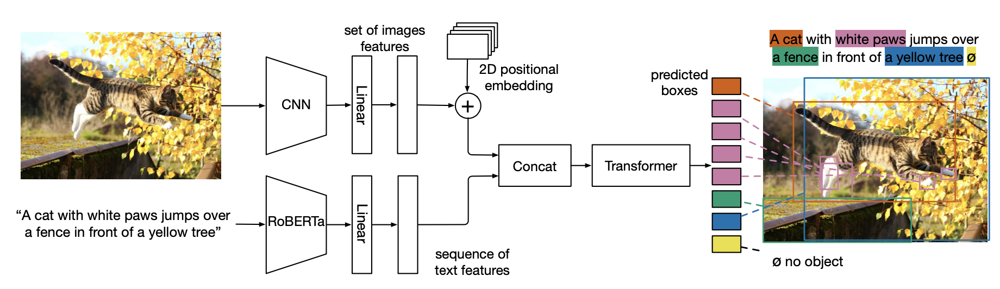

**MDETR**: Modulated Detection for End-to-End Multi-Modal Understanding
========

[Website](https://ashkamath.github.io/mdetr_page/) • [Colab](https://colab.research.google.com/drive/11xz5IhwqAqHj9-XAIP17yVIuJsLqeYYJ?usp=sharing) • [Paper](https://arxiv.org/abs/2104.12763)


This repository contains code and links to pre-trained models for MDETR (Modulated DETR) for pre-training on data having aligned text and images with box annotations, as well as fine-tuning on tasks requiring fine grained understanding of image and text. 

We show big gains on the phrase grounding task (Flickr30k), Referring Expression Comprehension (RefCOCO, RefCOCO+ and RefCOCOg) as well as Referring Expression Segmentation (PhraseCut, CLEVR Ref+). We also achieve competitive performance on visual question answering (GQA, CLEVR).




**TL;DR**. We depart from the fixed frozen object detector approach of several popular vision + language pre-trained models and achieve true end-to-end multi-modal understanding by training our detector in the loop. In addition, we *only* detect objects that are relevant to the given text query, where the class labels for the objects are just the relevant words in the text query. This allows us to expand our vocabulary to anything found in free form text, making it possible to detect and reason over novel combination of object classes and attributes.
                

For details, please see the paper: [MDETR - Modulated Detection for End-to-End Multi-Modal Understanding](https://arxiv.org/abs/2104.12763) by Aishwarya Kamath, Mannat Singh, Yann LeCun, Ishan Misra, Gabriel Synnaeve and Nicolas Carion.

Aishwarya Kamath and Nicolas Carion made equal contributions to this codebase. 

# Usage
The requirements file has all the dependencies that are needed by MDETR. 

We provide instructions how to install dependencies via conda.
First, clone the repository locally:
```
git clone https://github.com/ashkamath/mdetr.git
```

Make a new conda env and activate it: 
```
conda create -n mdetr_env python=3.8
conda activate mdetr_env
```

Install the the packages in the requirements.txt:
```
pip install -r requirements.txt
```

Multinode training

Distributed training is available via Slurm and [submitit](https://github.com/facebookincubator/submitit):
```
pip install submitit
```


# Pre-training

The links to data, steps for data preparation and script for running finetuning can be found in [Pretraining Instructions](.github/pretrain.md)
We also provide the pre-trained model weights for MDETR trained on our combined aligned dataset of 1.3 million images paired with text. 

The models are summarized in the following table. Note that the performance reported is "raw", without any fine-tuning. For each dataset, we report the class-agnostic box AP@50, which measures how well the model finds the boxes mentioned in the text. All performances are reported on the respective validation sets of each dataset.
<table>
<thead>
  <tr>
    <th rowspan="2"></th>
    <th rowspan="2">Backbone</th>
    <th>GQA</th>
    <th colspan="2">Flickr</th>
    <th colspan="4">Refcoco</th>
    <th rowspan="2"> Url<br></th>
    <th rowspan="2">Size<br></th>
  </tr>
  <tr>
    <td>AP</td>
    <td>AP</td>
    <td>R@1</td>
    <td>AP</td>
    <td>Refcoco R@1</td>
    <td>Refcoco+ R@1</td>
    <td>Refcocog R@1</td>
  </tr>
</thead>
<tbody>
  <tr>
    <td>1</td>
    <td>R101</td>
    <td>58.9</td>
    <td>75.6</td>
    <td>82.5</td>
    <td>60.3</td>
    <td>72.1</td>
    <td>58.0</td>
    <td>55.7</td>
    <td><a href="https://zenodo.org/record/4721981/files/pretrained_resnet101_checkpoint.pth?download=1"> model</a></td>
    <td>3GB</td>
  </tr>
  <tr>
    <td>2</td>
    <td>ENB3</td>
    <td>59.5</td>
    <td>76.6</td>
    <td>82.9</td>
    <td>57.6</td>
    <td>70.2</td>
    <td>56.7</td>
    <td>53.8</td>
    <td><a href="https://zenodo.org/record/4721981/files/pretrained_EB3_checkpoint.pth?download=1">model</a></td>
    <td>2.4GB</td>
  </tr>
  <tr>
    <td>3</td>
    <td>ENB5</td>
    <td>59.9</td>
    <td>76.4</td>
    <td>83.7</td>
    <td>61.8</td>
    <td>73.4</td>
    <td>58.8</td>
    <td>57.1</td>
    <td><a href="https://zenodo.org/record/4721981/files/pretrained_EB5_checkpoint.pth?download=1">model</a></td>
    <td>2.7GB</td>
  </tr>
</tbody>
</table>


# Downstream tasks

## Phrase grounding on Flickr30k
Instructions for data preparation and script to run evaluation can be found at [Flickr30k Instructions](.github/flickr.md)

### AnyBox protocol
| Backbone | Pre-training Image Data | Val R@1 | Val R@5 | Val R@10 | Test R@1 | Test  R@5 | Test  R@10 | url | size |
|----------|---------|---------|-----------|----------|-----------|-----------|-----|------|---|
| Resnet-101| COCO+VG+Flickr | 82.5   |  92.9   |   94.9  |   83.4  |   93.5  |   95.3    | [model](https://zenodo.org/record/4721981/files/pretrained_resnet101_checkpoint.pth?download=1)    | 3GB      | 
| EfficientNet-B3| COCO+VG+Flickr | 82.9   | 93.2    | 95.2    |  84.0  | 93.8    |  95.6    | [model](https://zenodo.org/record/4721981/files/pretrained_EB3_checkpoint.pth?download=1)    |  2.4GB     |
| EfficientNet-B5| COCO+VG+Flickr |83.6   | 93.4    | 95.1   |  84.3   | 93.9    |  95.8     | [model](https://zenodo.org/record/4721981/files/pretrained_EB5_checkpoint.pth?download=1)    |  2.7GB     |

 ### MergedBox protocol
 | Backbone | Pre-training Image Data | Val R@1 | Val R@5 | Val R@10 | Test R@1 | Test  R@5 | Test  R@10 | url | size |
|----------|---------|---------|-----------|----------|-----------|-----------|-----|------|---|
| Resnet-101| COCO+VG+Flickr | 82.3   |  91.8   |   93.7  |   83.8  |   92.7  |   94.4    | [model](https://zenodo.org/record/4721981/files/flickr_merged_resnet101_checkpoint.pth?download=1)    |  3GB     | 


## Referring expression comprehension on RefCOCO, RefCOCO+, RefCOCOg
Instructions for data preparation and script to run finetuning and evaluation can be found at [Referring Expression Instructions](.github/refexp.md)


### RefCOCO 

| Backbone | Pre-training Image Data | Val | TestA  | TestB | url | size |
|----------|---------|---------|-----------|----------|-----------|-----------|
| Resnet-101| COCO+VG+Flickr | 86.75   |  89.58   |   81.41  | [model](https://zenodo.org/record/4721981/files/refcoco_resnet101_checkpoint.pth?download=1)   |  3GB   |   
| EfficientNet-B3| COCO+VG+Flickr |  87.51  | 90.40  | 82.67 | [model](https://zenodo.org/record/4721981/files/refcoco_EB3_checkpoint.pth?download=1)  |  2.4GB   | 

### RefCOCO+

| Backbone | Pre-training Image Data | Val | TestA  | TestB | url | size |
|----------|---------|---------|-----------|----------|-----------|-----------|
| Resnet-101| COCO+VG+Flickr | 79.52   |  84.09  |   70.62  | [model](https://zenodo.org/record/4721981/files/refcoco%2B_resnet101_checkpoint.pth?download=1)   |  3GB  |   
| EfficientNet-B3| COCO+VG+Flickr |  81.13  | 85.52  | 72.96 | [model](https://zenodo.org/record/4721981/files/refcoco%2B_EB3_checkpoint.pth?download=1)   | 2.4GB   | 

### RefCOCOg

| Backbone | Pre-training Image Data | Val | Test  |  url | size |
|----------|---------|---------|-----------|----------|-----------|
| Resnet-101| COCO+VG+Flickr | 81.64 | 80.89    | [model](https://zenodo.org/record/4721981/files/refcocog_resnet101_checkpoint.pth?download=1)   |   3GB  |   
| EfficientNet-B3| COCO+VG+Flickr |  83.35  | 83.31  | [model](https://zenodo.org/record/4721981/files/refcocog_EB3_checkpoint.pth?download=1)  | 2.4GB   | 


## Referring expression segmentation on PhraseCut
Instructions for data preparation and script to run finetuning and evaluation can be found at [PhraseCut Instructions](.github/phrasecut.md)

| Backbone | M-IoU | Precision @0.5 | Precision @0.7 | Precision @0.9  |  url | size |
|----------|---------|---------|-----------|----------|-----------|-----------|
| Resnet-101| 53.1 | 56.1 | 38.9    | 11.9   | [model](https://zenodo.org/record/4721981/files/phrasecut_resnet101_checkpoint.pth?download=1)   |  1.5GB    |   
| EfficientNet-B3| 53.7| 57.5|  39.9  | 11.9 | [model](https://zenodo.org/record/4721981/files/phrasecut_EB3_checkpoint.pth?download=1)   | 1.2GB  | 


## Visual question answering on GQA
Instructions for data preparation and scripts to run finetuning and evaluation can be found at [GQA Instructions](.github/gqa.md)


| Backbone | Test-dev | Test-std  |  url | size |
|----------|---------|---------|-----------|----------|
| Resnet-101| 62.48 | 61.99 | [model](https://zenodo.org/record/4721981/files/gqa_resnet101_checkpoint.pth?download=1)    | 3GB  | 
| EfficientNet-B5| 62.95 | 62.45 | [model](https://zenodo.org/record/4721981/files/gqa_EB5_checkpoint.pth?download=1)   | 2.7GB | 

## Long-tailed few-shot object detection
Instructions for data preparation and scripts to run finetuning and evaluation can be found at [LVIS Instructions](.github/lvis.md)


| Data | AP | AP 50 |  AP r | APc | AP f | url | size
|----------|---------|---------|-----------|----------|---------|---------|---------|
| 1%| 16.7 | 25.8 | 11.2  | 14.6  | 19.5  | [model](https://zenodo.org/record/4721981/files/lvis1_checkpoint.pth?download=1) | 3GB
| 10%| 24.2 | 38.0 | 20.9   | 24.9 | 24.3 | [model](https://zenodo.org/record/4721981/files/lvis10_checkpoint.pth?download=1) | 3GB
| 100%| 22.5 | 35.2 | 7.4 |22.7 | 25.0 | [model](https://zenodo.org/record/4721981/files/lvis100_checkpoint.pth?download=1) | 3GB

## Synthetic datasets
Instructions to reproduce our results on CLEVR-based datasets are available at [CLEVR instructions](.github/clevr.md)

<table>
<thead>
  <tr>
    <th>Overall Accuracy</th>
    <th>Count</th>
    <th>Exist<br></th>
    <th>Compare Number</th>
    <th>Query Attribute</th>
    <th>Compare Attribute</th>
    <th>Url</th>
    <th>Size</th>
  </tr>
</thead>
<tbody>
  <tr>
    <td>99.7</td>
    <td>99.3</td>
    <td>99.9</td>
    <td>99.4</td>
    <td>99.9</td>
    <td>99.9</td>
    <td><a href="https://zenodo.org/record/4721981/files/clevr_checkpoint.pth?download=1"> model</a></td>
    <td>446MB</td>
  </tr>
</tbody>
</table>

# License
MDETR is released under the Apache 2.0 license. Please see the [LICENSE](LICENSE) file for more information.

# Citation 
If you find this repository useful please give it a star and cite as follows! :) :
```
    @article{kamath2021mdetr,
      title={MDETR--Modulated Detection for End-to-End Multi-Modal Understanding},
      author={Kamath, Aishwarya and Singh, Mannat and LeCun, Yann and Misra, Ishan and Synnaeve, Gabriel and Carion, Nicolas},
      journal={arXiv preprint arXiv:2104.12763},
      year={2021}
    }
```
